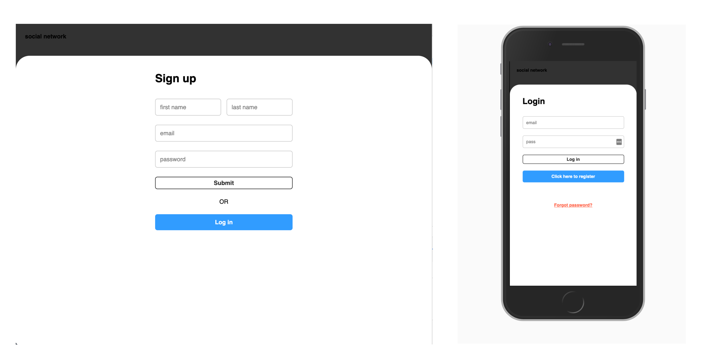
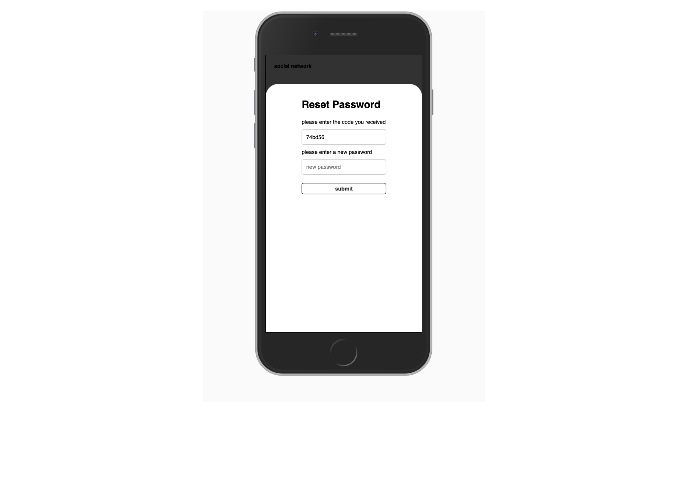
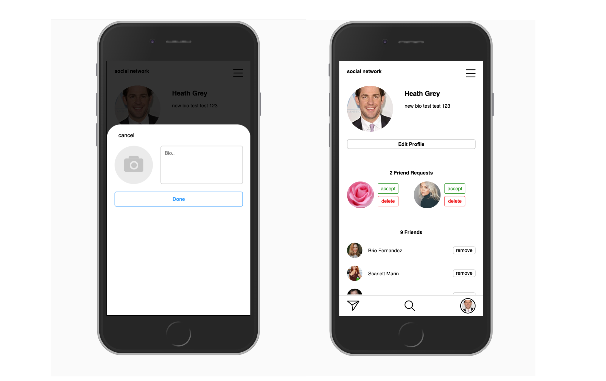
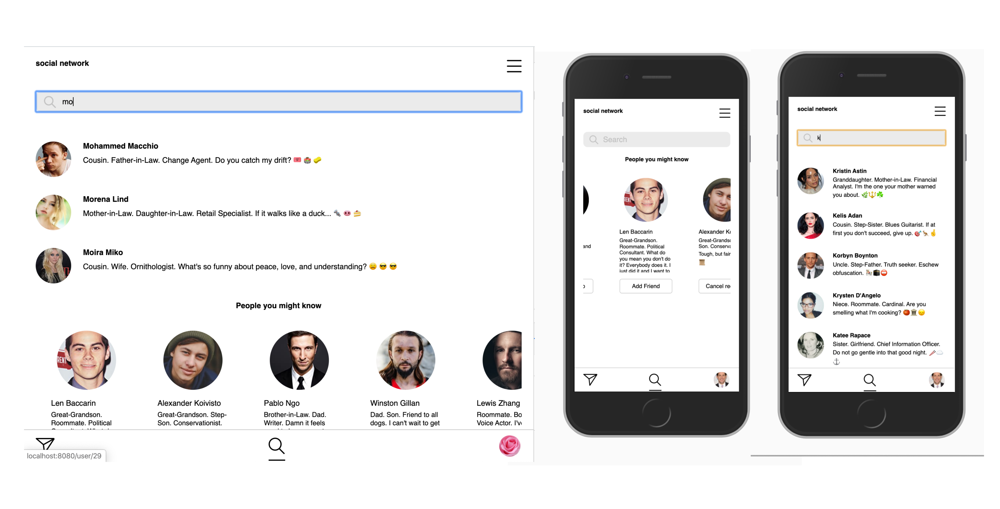
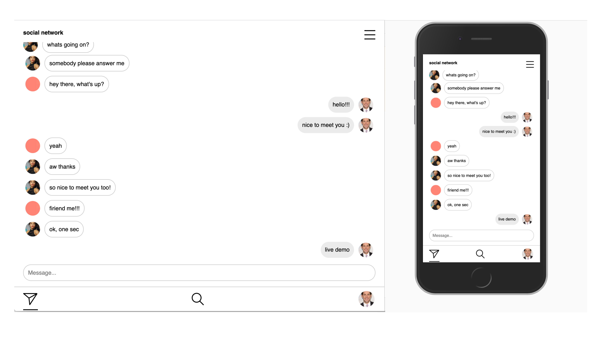
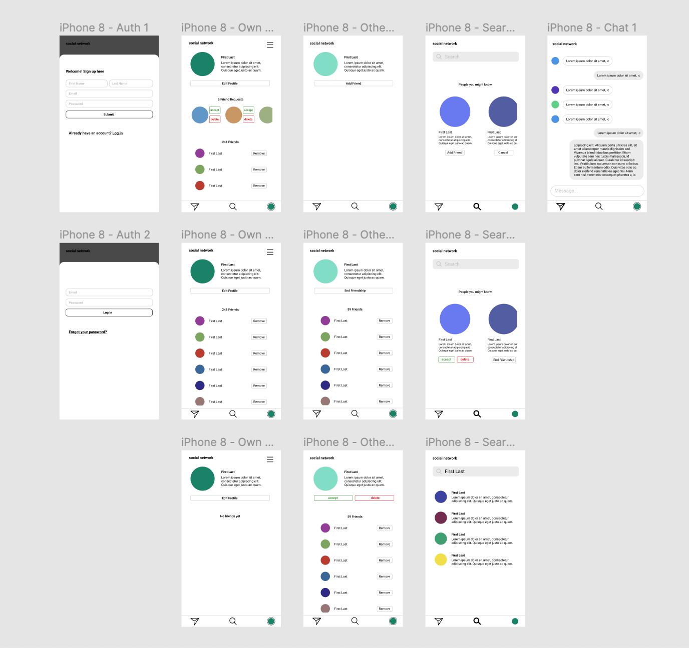

First time using React! It was a challenge to wrap my head around, especially later on when I started using Redux and Sockets, but it was so much fun and I'm very happy with how it turned out.

---

### Backend

In the back, a Node.js Express Server and a PostgreSQL database are CRUDfully keeping everything together. User information gets stored in multiple ways in the database: Aside from plain information like name, friendlists and chat messages, user profile pictures get uploaded to AWS S3, with a reference in the database. Furthermore, passwords are being salted, hashed and encrypted with Node and Bcrypt. Cookie-Sessions authenticate already logged in users. The platform is protected from potential SQL injections and CSURF Attacks.

---

### Reset your password

Upon request, a key with an expiration date of ten minutes gets stored in a Redis database and gets send out via AWS SES. If the entered key checks out, the user can then change their password.

---

### Edit profile

Edit your profile and add a profile picture or a bio to show your friends who you are

---

### Friend other users

A search functionality lets you search for all registered users by their name. Additionally, the twenty latest users who signed up get recommended. After visiting another profile page, users can send a friend request. Once that request gets accepted by the other profile, they can both see each others friends list.

---

### Live chat

Using the WebSocket protocol with Socket.io, a site wide live chat is available for all logged in users to interact with.

---

### Frontend

In the front, reusable React components make use of the global Redux state and provide a intuitive and fast user experience.

The mobile first styling in CSS may or may not look familiar, but for learning purposes it was the smartest thing one could've done 😉

---
